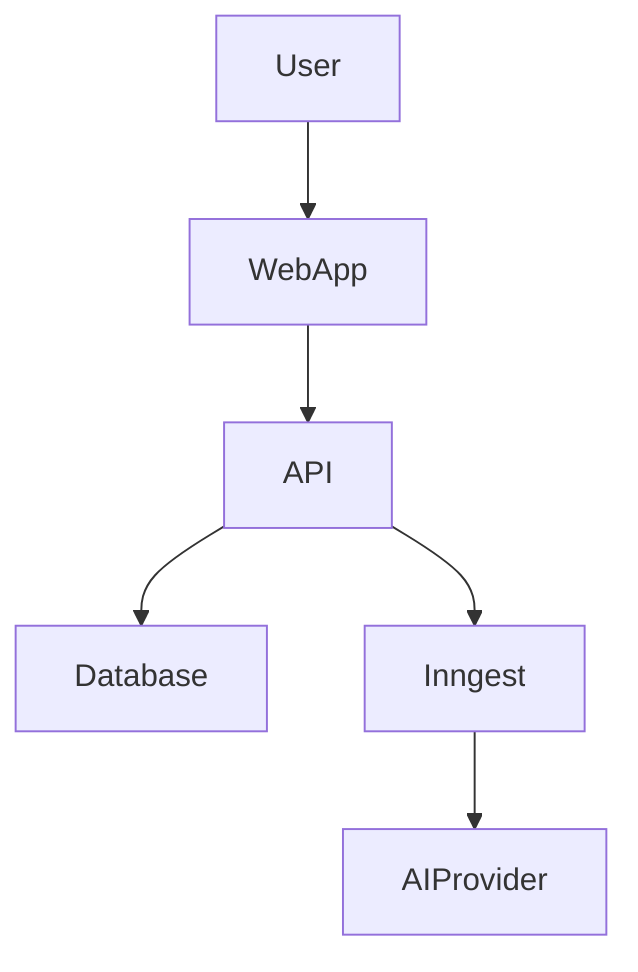
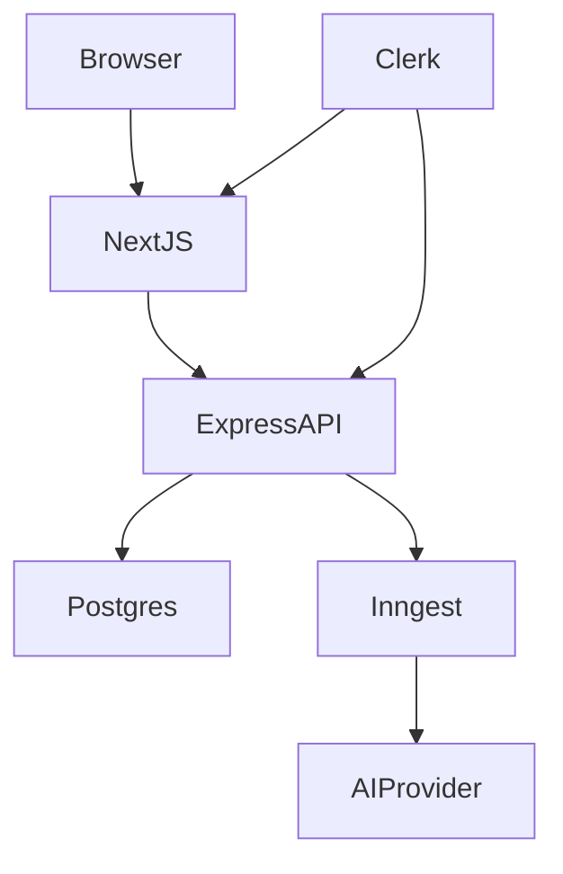
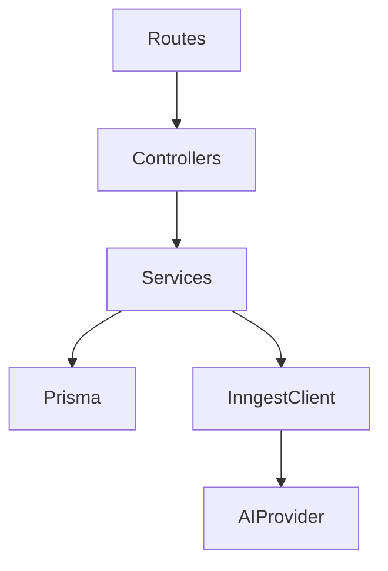
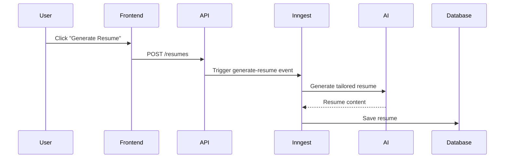
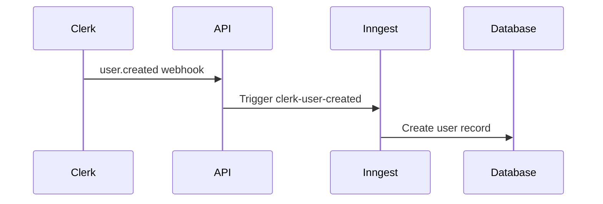

## 📐 Architecture Diagrams (C4 Model)

### 🌍 C4 – Context Diagram

Shows the system at a high level and how it interacts with users and external services.

---

### 📦 C4 – Container Diagram

Highlights the major runtime containers and responsibilities.

---

### 🧠 C4 – Component Diagram (Backend)

Demonstrates separation of concerns inside the backend.

---

## 🔄 AI Workflow – Resume Generation

The user does not wait for AI processing; results are handled asynchronously.

---

## 🔔 Clerk Webhook Flow

This ensures user data is synchronized safely and reliably.
